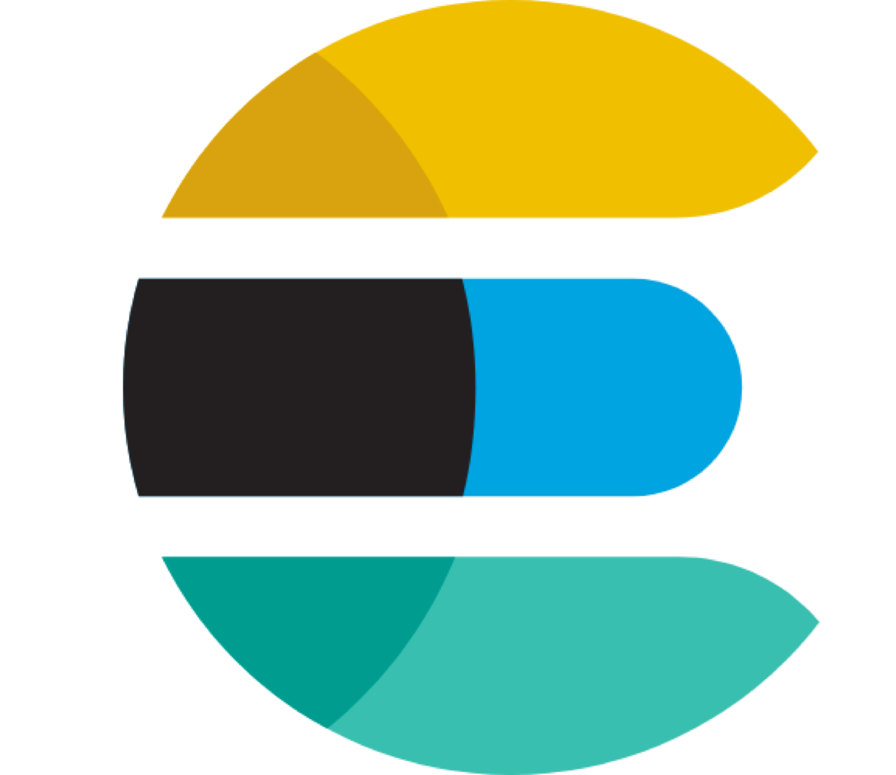

### Hi there, I'm Vaibhav Sachdeva</a> 

### Glad to see you here! &nbsp;

I'm a recent graduate from Shiv Nadar University 🏛, with a major in Electronics and Communication Engineering, and a minor in Big Data Analytics 🎓. I'm a self-motivated learner, who's always willing to learn new technologies 👀, and leverage them to solve real-life problems 💡.

### More about me:

- 💻 Currently working as a Software Engineer at Dell Technologies. 
- 🚀 Deeply passionate about Data Science, and Artificial Intelligence - Machine Leanring, and Deep Learning. 
- 🌱 Currently learning React.JS, and Reinforcement Learning.
- 📝 Checkout my [Resume](https://drive.google.com/file/d/10Z14WHmnEBl4_X8B0cHDQeYR09sjMsJ8/view?usp=sharing).

<h2> 🛠 &nbsp;My Tech Stack</h2>

<b>Programming Languages</b>

&nbsp;
 &nbsp;
&nbsp;
&nbsp;
&nbsp;
&nbsp;

	

<b>Machine Learning/Deep Learning Frameworks</b>

&nbsp;
&nbsp;
&nbsp;
&nbsp;&nbsp;
&nbsp;

	

<b>Backend Development (Languages and Tools)</b>

&nbsp;
&nbsp;
&nbsp;
&nbsp;
&nbsp;

	
 
<b>Frontend Development (Languages and Tools)</b>

 &nbsp;
&nbsp;
&nbsp;
&nbsp;

<h2>⚡&nbsp;Github Stats</h2>

